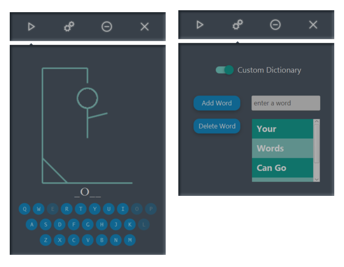

# JavaFXHangman

## [Watch a video demo here](https://youtu.be/-0agdFWO8us)

This is a javafx hangman game designed to be sleek and custom. It has animations and uses the JFoenix library. It features an always-on-top functionality, state persitence, and a word-list of almost 1000 words. You can, however, make your own word-list if you would like. If anyone enjoys this game and wants a bigger word-list or some reasonable feature, just drop me a line, and I'd be happy to oblige.

If you would like to play this game, there is an installer called FXHangmanInstaller.exe that is very straightforward to use.

###### If you want to fork this repository, or you would like to edit the code, it is important for you to know that this project was made using the Eclipse IDE with Java 1.8 using [JFoenix](https://github.com/jfoenixadmin/JFoenix) and JavaFX. You must import JFoenix if you want the code to run.
